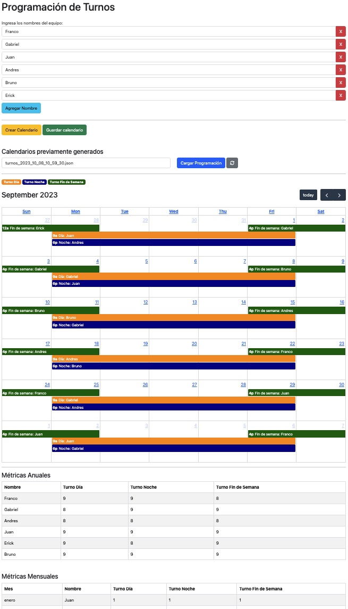

# Genetic Shift Scheduler

## Table of Contents

- [Genetic Shift Scheduler](#genetic-shift-scheduler)
  - [Table of Contents](#table-of-contents)
  - [Overview](#overview)
  - [Key Components:](#key-components)
    - [Genetic Algorithm:](#genetic-algorithm)
    - [User Interface:](#user-interface)
  - [Quick System Usage Guide](#quick-system-usage-guide)
    - [Installation and Configuration:](#installation-and-configuration)
    - [System Usage:](#system-usage)
  - [Technical Details](#technical-details)
    - [Back-end (Python with Flask):](#back-end-python-with-flask)
    - [Front-end (HTML and JavaScript):](#front-end-html-and-javascript)
  - [Individual Design and Encoding](#individual-design-and-encoding)
    - [Individual Structure:](#individual-structure)
    - [Genetic Representation:](#genetic-representation)
    - [Evaluation through Fitness Function](#evaluation-through-fitness-function)
  - [Software Requirements for Shift Management with Genetic Algorithm Focus](#software-requirements-for-shift-management-with-genetic-algorithm-focus)
    - [Shift Definition:](#shift-definition)
    - [Allocation Guidelines:](#allocation-guidelines)
    - [3. Evaluation and Metrics:](#3-evaluation-and-metrics)
    - [4. Equity and Optimization:](#4-equity-and-optimization)
  - [Contributions](#contributions)

---

## Overview

The **Genetic Shift Scheduler** is an innovative tool that employs genetic algorithms to generate optimal work schedules for an entire year, distributing shifts equitably among employees while respecting shift allocation restrictions.

  

## Key Components:

### Genetic Algorithm:
- **Chromosome**: Represents a shift assignment for the entire year.
- **Fitness function**: Evaluates the equitability of a solution.
- **Operators**: Crossover, mutation, and selection.
- **Execution and Evaluation**: Executes the algorithm and evaluates the results.

### User Interface:
   Flask and HTML are used to construct a web interface that allows:
   - Entering the names of the workers.
   - Requesting a new shift optimization.
   - Viewing the assignments.
   - Saving and loading previous schedules.

---

## Quick System Usage Guide

### Installation and Configuration:

1. **Configure the Virtual Environment:** Run the `make dev` command. This step will install the necessary requirements and create a virtual environment (virtualenv) for the system.

2. **Run the Server:** Once the environment has been set up, start the Flask server with the `make run` command. After executing it, the service will be available on port `5000`.

### System Usage:

3. **Access the Interface:** Open a browser and visit `http://localhost:5000` to access the web interface of the system.

4. **Worker Registration:** Enter the names of the workers you wish to schedule.

5. **Schedule Generation:** Click the "Create Calendar" button. The system will automatically generate a schedule based on the names you provided.

6. **Visualization:** Observe the shifts on the calendar and the metrics indicating how the shifts were distributed among the workers.

7. **Save and Load (Optional):** If desired, you can save the generated schedule for later consultation or load a schedule that you previously saved.

---

## Technical Details

### Back-end (Python with Flask):

- The `deap` library is used to implement the genetic algorithm.
- Several auxiliary functions are defined to respect shift requirements. For example: `is_valid`, `backtrack`, `init_individual`, `evaluate`, and `mutate_individual`.
- A web API is implemented using Flask, with endpoints for optimizing the schedule (`/optimize`), saving (`/save_schedule`), loading (`/load_file_schedule`), and listing schedule files (`/list_schedules`).

### Front-end (HTML and JavaScript):

- Bootstrap is used for design and stylization.
- An interface is provided for entering worker names.
- Shifts are visualized on a calendar using `FullCalendar`.
- Actions are allowed for creating, saving, and loading shift schedules.

---

## Individual Design and Encoding

### Individual Structure:

The individual is a representation of an annual schedule. Given a set of `T` shifts (for example, morning, afternoon, night) and `E` employees, an individual is visually organized as follows:

| Week 1 | Week 2 | ... | Week 52 |
|:------:|:------:|:---:|:-------:|
|   A    |   B    | ... |   C     |
|   B    |   C    | ... |   D     |
|   C    |   D    | ... |   A     |

In this structure:
- **Each row** represents a shift. For example, the first row might represent the morning shift, the second row the afternoon shift, and so on.
- **Each cell** within a row indicates the employee assigned to that specific shift during that particular week.

### Genetic Representation:

The genetic representation of an individual is carried out through a chromosome. In this chromosome:
- Each gene is an integer number that ranges between $1$ and $E$, representing the identification of an employee.
- The position of each gene in the chromosome determines which shift and week it refers to. For example, the first gene might refer to the morning shift of week $1$, the second to the afternoon shift of week $1$, and so forth.

### Evaluation through Fitness Function

To assess the quality of a proposed schedule (or individual), a fitness function is utilized. The formula for this function is expressed as follows:

$$f(i) = w_1 \times D_{\text{annual}}(i) + w_2 \times D_{\text{monthly}}(i)$$

Here's a breakdown of the elements within this formula:
- $f(i)$: Denotes the fitness or the quality of the schedule for individual $i$.
- $D_{\text{annual}}(i)$: Gauges the variability or disparity in shift distribution across the year for individual $i$.
- $D_{\text{monthly}}(i)$: Assesses the deviation or inconsistency in shift assignments for individual $i$ in a particular month.
- $w_1$ and $w_2$: These are weights or coefficients assigned to balance the significance between the annual and monthly shift distributions. In this implementation, $w_1$ is set to $2$, and $w_2$ is set to $1$, indicating a higher priority is given to the annual distribution of shifts.

This fitness function is engineered to ensure that the generated schedule is equitable on both an annual and monthly basis. This is pivotal in ensuring that no employee is unfairly treated in shift allocations, and the distribution of shifts aligns well with the organizational goals. With the specified weights, the function will lean towards solutions that offer a fairer annual distribution of shifts.

## Software Requirements for Shift Management with Genetic Algorithm Focus

### Shift Definition:

**a. Weekend Shift:** 
  - **Interval:** From Friday at 16:01 to Monday at 08:59.
  - **Restriction:** The same employee must be in charge throughout the duration of the shift, from the start on Friday to the end on Monday.

**b. Day Shift:** 
  - **Interval:** 
    - Monday to Thursday: 9:01 to 17:59.
    - Friday: 9:01 to 15:59.
  - **Restriction:** A single employee should be responsible throughout the workweek, that is, from Monday to Friday.

**c. Night Shift:** 
  - **Interval:** Monday to Thursday: 18:01 to 8:59 of the next day.
  - **Restrictions:** 
    - The same employee covers from Friday to Sunday.
    - Must not be the employee assigned to the Day Shift of the same week.
    - Occurs simultaneously with the Day Shift.

### Allocation Guidelines:

**a. For the Employee on Day Shift:**
  - Must not be assigned to the Night nor Weekend shifts in that same week.
  - Should be placed on the Night Shift the following week.

**b. For the Employee on Night Shift:** 
  - Must not be assigned to the Day nor Weekend shifts during that week.
  - Is guaranteed a rest period the following week, with no assignments.

**c. For the Employee on Weekend Shift:** 
  - Must not be assigned to the Day nor Night shifts during the same week.

### 3. Evaluation and Metrics:

**a. General Reports:** 
  - The software should provide both monthly and annual metrics, aimed at evaluating the equity of shift distribution among all employees.

**b. Shift Distribution:** 
  - It is essential to visualize the frequency with which each type of shift is assigned to each employee and compare that distribution with a theoretically equitable distribution.

### 4. Equity and Optimization:

- The core of the software, the genetic algorithm, should be oriented to finding a solution that promotes equity in shift distribution. This ensures that, over time, all employees receive a similar amount of each type of shift.

---

## Contributions

All contributions are welcome. See [CONTRIBUTING.md](./CONTRIBUTING.md) for more details on how to collaborate on this project.
